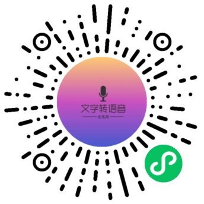

## 系统说明

- 基于 微软开源的TTS语音库 文字转语音，文字转mp3
- 代码采用 flask+ edge-tts +python3.9+gunicorn + cos 直接可以运行在docker项目中,接口根据文字、主播 生成语音并上传到腾讯云COS云存储


## 小程序体验
我用本项目代码 + uniapp 做了一个文字转语音的微信小程序，可以扫码试用下看下效果




### 本地运行
```
# 国内镜像下载python库
pip install  -r requirements.txt -i https://pypi.tuna.tsinghua.edu.cn/simple

#python直接运行 接口服务器
python3 edge-tts.py

#浏览器接口访问
http://localhost:2022/dealAudio?text=欢迎使用tts&file_name=1.mp3&voice=xiaoxiao

```


静待音频生成之后就可以听到 "网红晓晓" 的声音了，tts支持的语音有很多
本项目只是用了中文发音的主播，如：晓晓、云希、云杨等都是抖音里的常用网红主播...


### 服务器部署
```
# 文件上传到服务器之后，直接运行dockerRun.sh 就可以了

[root@VM_43_255_centos python_tts]# ./dockerRun.sh 
python_tts
python_tts
Sending build context to Docker daemon  17.96MB
Step 1/6 : FROM python:3.8.4
 ---> ea8c3fb3cd86
Step 2/6 : COPY requirements.txt ./
 ---> Using cache
 ---> 0c97033f1256
Step 3/6 : RUN pip install  -r requirements.txt -i https://pypi.tuna.tsinghua.edu.cn/simple
 ---> Using cache
 ---> f194e15e3fcd
Step 4/6 : COPY . /flask_project/
 ---> Using cache
 ---> 92b41981b287
Step 5/6 : WORKDIR /flask_project/
 ---> Using cache
 ---> 0b7e9dc8eb16
Step 6/6 : CMD ["gunicorn", "edge-tts:app", "-c","gunicorn.conf"]
 ---> Using cache
 ---> e4bb9421777d
Successfully built e4bb9421777d
Successfully tagged python_tts:latest
27607380de042b36f678167160e176749f78b44a903c08a7ebde76868a3c5aa4

#docker服务创建完成 通过外网接口调用即可

```
